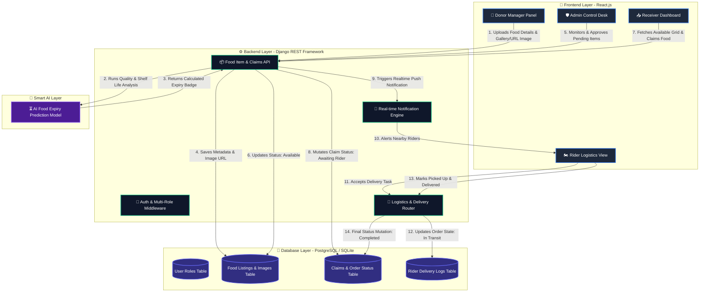

# 🍲 Food Donation Platform - Master System Architecture

```mermaid
graph TD
    %% Styling Subgraphs
    classDef frontend fill:#1e293b,stroke:#3b82f6,stroke-width:2px,color:#fff;
    classDef backend fill:#0f172a,stroke:#10b981,stroke-width:2px,color:#fff;
    classDef database fill:#312e81,stroke:#6366f1,stroke-width:2px,color:#fff;
    classDef ai fill:#4c1d95,stroke:#8b5cf6,stroke-width:2px,color:#fff;

    %% FRONTEND MODULE (React + Tailwind)
    subgraph FRONTEND [📱 Frontend Layer - React.js]
        A1[🍲 Donor Manager Panel]
        A2[📥 Receiver Dashboard]
        A3[🏍️ Rider Logistics View]
        A4[🛡️ Admin Control Desk]
    end

    %% BACKEND MODULE (Django REST API)
    subgraph BACKEND [⚙️ Backend Layer - Django REST Framework]
        B1[🔑 Auth & Multi-Role Middleware]
        B2[📦 Food Item & Claims API]
        B3[🚚 Logistics & Delivery Router]
        B4[🔔 Real-time Notification Engine]
    end

    %% AI / PREDICTION MODULE
    subgraph AIMODULE [🧠 Smart AI Layer]
        C1[⏳ AI Food Expiry Prediction Model]
    end

    %% DATABASE MODULE
    subgraph DATABASE [💾 Database Layer - PostgreSQL / SQLite]
        D1[(User Roles Table)]
        D2[(Food Listings & Images Table)]
        D3[(Claims & Order Status Table)]
        D4[(Rider Delivery Logs Table)]
    end

    %% DATA FLOW CONNECTIONS
    
    %% Donor Actions
    A1 -->|1. Uploads Food Details & Gallery/URL Image| B2
    B2 -->|2. Runs Quality & Shelf Life Analysis| C1
    C1 -->|3. Returns Calculated Expiry Badge| B2
    B2 -->|4. Saves Metadata & Image URL| D2

    %% Admin Approval
    A4 -->|5. Monitors & Approves Pending Items| B2
    B2 -->|6. Updates Status: Available| D2

    %% Receiver Claim
    A2 -->|7. Fetches Available Grid & Claims Food| B2
    B2 -->|8. Mutates Claim Status: Awaiting Rider| D3
    B2 -->|9. Triggers Realtime Push Notification| B4
    B4 -->|10. Alerts Nearby Riders| A3

    %% Rider Delivery Flow
    A3 -->|11. Accepts Delivery Task| B3
    B3 -->|12. Updates Order State: In Transit| D4
    A3 -->|13. Marks Picked Up & Delivered| B3
    B3 -->|14. Final Status Mutation: Completed| D3

    %% Apply CSS Classes
    class A1,A2,A3,A4 frontend;
    class B1,B2,B3,B4 backend;
    class C1 ai;
    class D1,D2,D3,D4 database;
```